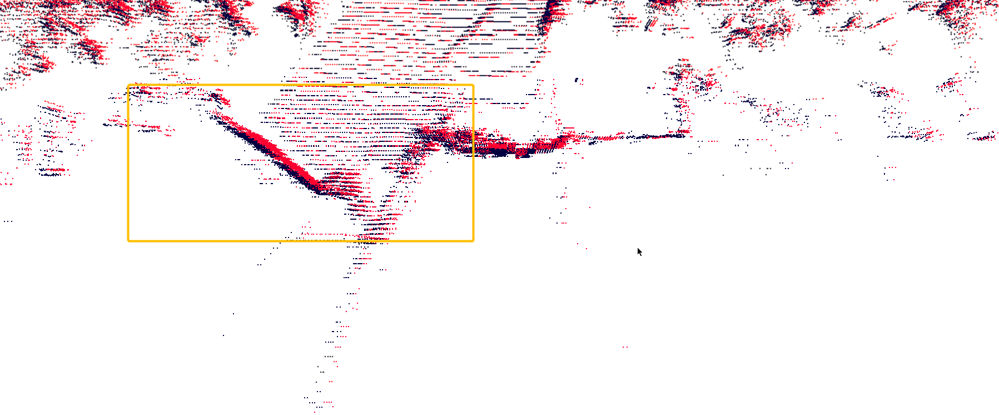
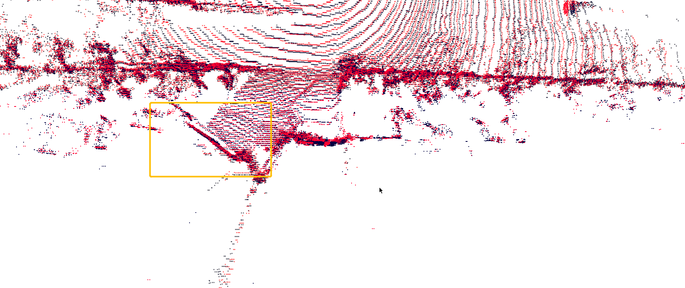

# build
cd path/calib_example/calib
mkdir build & cmake ..
make
## Get Trans Matrxi
prepare point cloud to be calib and get trans maxtrix
python3 get_trans.py

## Visual Calibration
visual two point cloud before and after calibration
python3 viz_calib.py

从有pose有问题bag包获取相邻两帧点云，叠帧后可视化

经过配准后叠帧的图片，明显可见重影没有了

## docker

